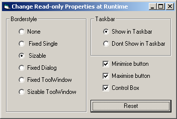



## Changing Forms Read Only Properties at Runtime

### Description

This submission is prompted by a question in Ask a Pro. Allows you to change some readonly properties at runtime.
 
### More Info
 

             |
---                |---
**Submitted On**   |2002-05-03 06:26:48
**By**             |[MrBobo](https://github.com/Planet-Source-Code/PSCIndex/blob/master/ByAuthor/mrbobo.md)
**Level**          |Beginner
**User Rating**    |4.8 (29 globes from 6 users)
**Compatibility**  |VB 5\.0, VB 6\.0
**Category**       |[VB function enhancement](https://github.com/Planet-Source-Code/PSCIndex/blob/master/ByCategory/vb-function-enhancement__1-25.md)
**World**          |[Visual Basic](https://github.com/Planet-Source-Code/PSCIndex/blob/master/ByWorld/visual-basic.md)
**Archive File**   |[Changing\_F78641522002\.zip](https://github.com/Planet-Source-Code/mrbobo-changing-forms-read-only-properties-at-runtime__1-34367/archive/master.zip)

